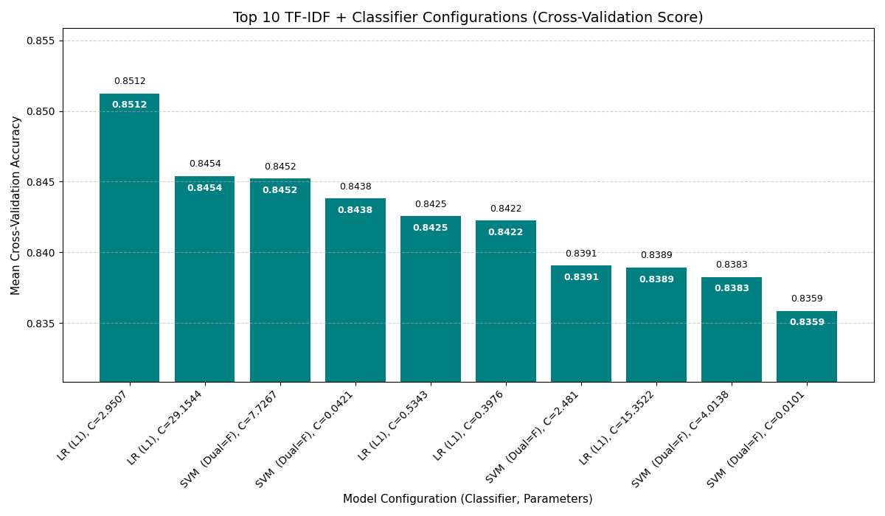

# Amazon Review Sentiment Analyzer 🚀

A high-performance text classification project that uses the efficient **TF-IDF Vectorizer** combined with a robust **Logistic Regression** model to classify Amazon reviews as either positive or negative. The model is deployed through a simple and interactive **Streamlit** web application.

---

## ✨ Key Features

- **Binary Sentiment Classification**  
  Predicts sentiment as **POSITIVE** or **NEGATIVE**.

- **Highly Optimized Pipeline**  
  Employs a scikit-learn pipeline combining **TF-IDF + Linear Classifier**.

- **Strong Performance**  
  Achieved **85.12% mean cross-validation accuracy**.

- **Scalable Data Handling**  
  Trained on a **100k-row sample**, efficient for large datasets.

- **Web Deployment**  
  Served via **Streamlit** (`app.py`) for real-time testing.

---

## 🧠 Model Performance & Methodology

### Classification Pipeline

1. **Feature Extraction** — TF-IDF converts text into sparse numerical vectors.  
2. **Classifier Evaluation** — Compared:  
   - Logistic Regression  
   - Linear SVC  
3. **Hyperparameter Optimization**  
   - Performed with **RandomizedSearchCV**  
   - **3-fold cross-validation**  
   - Tuned on **100k training samples**

---

## 📈 Top 10 Model Configurations (Cross-Validation Accuracy)

Below is the performance chart of the top 10 TF-IDF + classifier configurations discovered during the hyperparameter search.

> **L1-regularized Logistic Regression** consistently outperformed SVM variants.

### 📊 Chart

  
---

## 📊 Dataset Overview: Amazon Review Polarity Dataset

| Detail | Description |
|--------|-------------|
| **Origin** | Stanford Network Analysis Project (SNAP) |
| **Dataset Size** | 3.6M samples total (1.8M train per class) |
| **Data Used** | 100k training sample |
| **Labels** | 1 = Negative, 2 = Positive |
| **Columns** | polarity, title, text |

### Dataset Description

Created by **Xiang Zhang**, this dataset uses review-score mappings:
- **1 & 2 → Negative**
- **4 & 5 → Positive**
- Score **3 removed** to avoid neutrality bias.

Both classes are perfectly balanced, making it ideal for binary classification.

---

## ⚙️ Setup & Running the Application

### 📦 Running locally
1. Clone the repo
```bash
git clone git@github.com:bunny-ml/Sentiment_Analysis.git
cd Sentiment_Analysis
```

2. Installing Requirements (exact versions of libs are not given as they dont matter use the latest one)
```
pip install -r requirements.txt
```
3. Run app
```
streamlit run app.py
```


